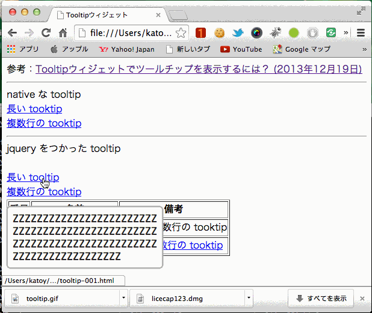
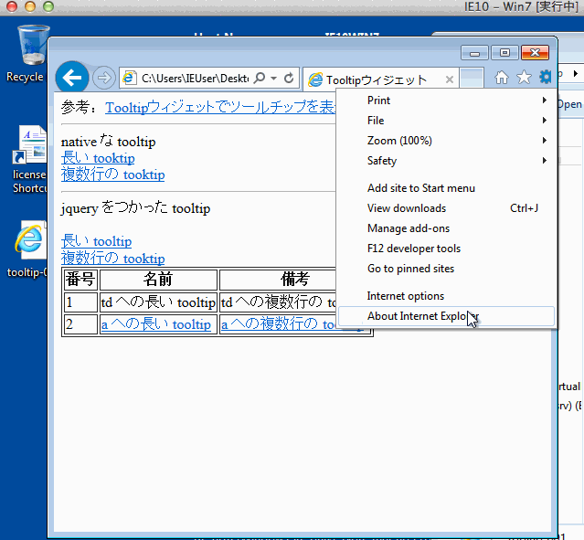
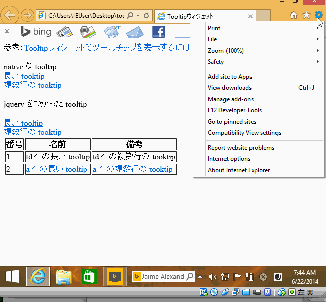

# 課題
browser (Chrome) での  
　　title 属性 の tooltip　表示  
　　jquery での tooltip 表示  
ともに満足できる表現ではない。  

tooltip-000.html を chrome (35.0.1916.153 on MacOXX 10.9.3) で操作した アニメーション gif.

## 次のことを実現したい。
- 表示フォントを指定する (等幅フォントに)
- 長い文字列を適宜 折り返し表示させる。
- 角丸にする。

# 対処

- css で .ui-tooltip に　等幅フォントを指定する。
- 折り返し方法を指定する。
- corner-round を指定する。

    .ui-tooltip {
      font-family: Osaka-mono, "Osaka-等幅", "ＭＳ ゴシック", monospace; font-size: 20px;
      width: 240px;
      word-wrap: break-word;
      border-radius: 6px;
      background: #FEFFED;
    }

tooltip-001.html を chrome (35.0.1916.153 on MacOXX 10.9.3) で操作した アニメーション gif.

IE での動作は VirtaualBox で確認した。  
tooltip-001.html を IE10 で操作した アニメーション gif.

tooltip-001.html を IE11 で操作した アニメーション gif.

# 参考

- http://qiita.com/suzukima/items/be1ab67e0a9c9b11a8ef  
 > OSXのChrome/Safariにて、全角幅=2半角幅で等幅表示するためのCSS  

- http://weblan3.com/css/word-break.php  
 > word-break - 文の改行の仕方について指定する  

- http://www.cssportal.com/css-tooltip-generator/  
 > CSS Tooltip Generator  

- http://www.d-wood.com/blog/2014/01/27_5343.html  
 > MacにIEテスト環境を作る（VirtualBox 編）  
